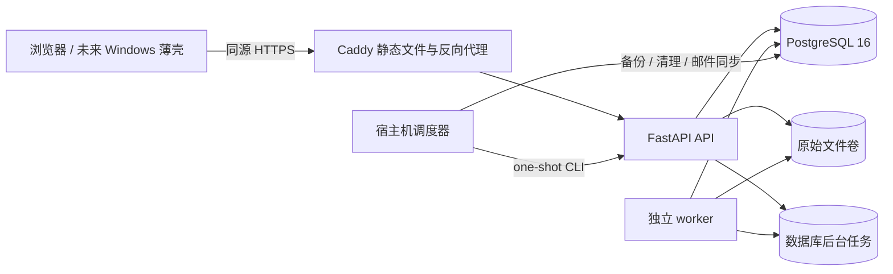

# 系统架构与数据模型

本文件是当前实现的技术架构说明。代码、数据库迁移和生产 Compose（容器编排）配置优先于本文；本文用于解释边界、生命周期和维护方式。

## 1. 总体架构



生产环境只有四个 Compose 服务：

1. `caddy`（网页服务器）：提供编译后的 React（前端框架）静态文件、SPA（单页应用）路由回退、HTTPS 和 `/api`、`/health` 反向代理。
2. `api`（接口服务）：账号、接入、查询、配置、导出、邮件操作和维护 API；不在 HTTP 请求中解析 Excel。
3. `worker`（后台任务进程）：从数据库任务表领取导入和分析任务，执行解析、标准化、校验和分析落库。
4. `db`（PostgreSQL 16 数据库）：保存账号、审计、配置、原始文件元数据、标准化估值、分析结果和任务状态。

不引入 Redis（缓存/队列）、Celery（任务框架）、对象存储、Kubernetes（集群编排）或独立前端服务。当前规模是十几个产品、每天几十个文件，数据库任务表加单个 worker 足够简单且可恢复。

## 2. 代码分层

```text
backend/app/
  api/             HTTP 路由、请求校验、权限映射和响应组装
  auth/            本地账号、会话和角色依赖
  db/              SQLAlchemy 模型、枚举、会话和迁移入口
  parser/          Excel 读取、标准化和估值表解析
  imports/         原始文件接收、批次处理、任务领取和状态流转
  publishing/      估值版本复核、发布、替代、撤回和恢复
  analytics/       净值、回撤、资产配置、集中度、公司指标和持久化分析
  validation/      纯校验规则和校验服务
  risk/            风险规则计算器
  mail/            IMAP（邮件接收协议）只读同步和凭据文件
  system/          运维摘要、备份、原始文件清理和系统设置
  migration/       历史文件清单、预演和断点迁移
  bootstrap.py     生产业务目录初始化
  worker.py        worker 进程入口
  maintenance_cli.py  一次性维护命令入口
```

`tools/valuation_inventory` 是历史目录只读盘点工具。后端镜像会把它作为同一仓库的一部分安装，迁移模块通过稳定接口调用，保证本地盘点和生产预检不各自维护一套识别规则。迁移模块的清单生成、预演和 HTTP 上传均使用 API 的 `fund_session` Cookie（浏览器会话凭据）认证；上传前仍必须先完成样本验收。

## 3. 一次导入的生命周期

```text
手工上传 / 邮件附件 / 历史迁移
        |
        v
安全临时写入 -> 文件头校验 -> SHA-256 去重 -> source_file
        |
        v
import_batch + import_batch_file
        |
        v
complete -> background_job(process_import_batch)
        |
        v
worker 领取租约 -> 读取 Excel -> 识别身份 -> 标准化落库
        |
        v
校验 -> publishable 或 pending_review / failed / non_valuation
        |
        v
人工复核 -> publish -> background_job(process_analysis_run)
        |
        v
worker 计算指标、风险事件并落库 -> 看板读取已发布结果
```

### 3.1 文件安全

- 上传先落到配置的临时目录，不直接写正式对象目录。
- 扩展名、文件头、单文件大小、工作簿工作表/行/列上限均检查。
- 正式对象名由服务端生成；原始文件名不参与路径拼接。
- `file_hash` 使用 SHA-256（安全哈希）唯一约束。同内容文件不重复保存，只增加批次关联并返回重复标记。
- 原始文件下载必须同时满足批次关联、角色权限、根目录约束和审计记录。

### 3.2 任务租约

任务领取使用独立短事务。PostgreSQL 下使用 `FOR UPDATE SKIP LOCKED`（行锁并跳过已锁定记录），领取后生成租约令牌。完成或失败更新必须匹配当前令牌；租约过期可以被重新领取，达到最大尝试次数后失败。

导入或分析业务写入与租约完成在同一调用事务中提交。租约失效时业务写入回滚，旧 worker 不能覆盖新 worker 的结果。当前 worker 默认串行领取任务，配置保留 `task_concurrency` 字段但现有进程不热扩展并发数量。

## 4. 数据模型

### 4.1 身份和审计

- `user_account`：用户名、显示名、Argon2id（密码哈希算法）密码摘要、角色、状态、失败次数、锁定时间和登录时间。
- `user_session`：服务端会话；浏览器只拿随机令牌，数据库只保存 SHA-256 摘要、有效期和吊销时间。
- `system_state`：单例系统状态，保存 bootstrap（初始化）指纹、系统白名单设置、邮件开关和 worker 心跳。
- `audit_log`：操作人、动作、资源、脱敏摘要、原因、结果和时间。审计没有删除 API。

### 4.2 产品配置

- `fund`：标准名称、产品代码、成立日期、可选策略、管理人、备注和启停状态。
- `fund_alias`：产品别名、来源位置、匹配优先级和有效期。
- `share_class`：份额代码、名称、启停日期和备注。
- `subject_mapping`：科目代码/前缀、原始名称模式、标准类别、叶子标记、是否纳入持仓、有效期、规则版本和状态。
- `parser_rule_set`：模板规则集元数据；当前解析流程使用固定模板标识并保留规则集模型扩展点。

配置改变只影响后续解析或后续业务操作，不重写已保存的历史估值明细。

### 4.3 来源和导入

- `source_message`：邮件 Message-ID（邮件唯一标识）、发件人、主题、接收时间和同步批次；用于邮件幂等。
- `source_file`：原始文件名、SHA-256、大小、扩展名、来源类型、随机对象名和保留截止日期。
- `import_batch`：来源、创建人、文件数、批次状态和时间。
- `import_batch_file`：批次与原始文件的关联，以及同批次重复标记。
- `background_job`：任务类型、状态、尝试次数、租约、错误编号、资源编号和重试时间。

### 4.4 估值和校验

- `valuation_version`：产品、估值日、版本号、来源文件、解析规则、状态、发布人、发布原因和发布时间。同产品同日同版本号唯一；同产品同日只能有一个已发布版本。
- `validation_result`：规则编码、级别、实际值、期望值、差异、来源位置和消息。
- `field_provenance`：标准字段到工作表、行、列、原文和转换方式的来源记录。
- `fund_daily_snapshot`：产品级资产负债、净值、收益率、累计派现和可用头寸。
- `share_class_daily_snapshot`：估值版本下每个份额类别的净资产、实收资本、净值和日收益。
- `account_subject_daily`：原始科目层级、标准类别、是否叶子、持仓纳入标记、数量、成本、市值、权重和来源位置。
- `position_daily`：叶子持仓的证券、市场、账户、数量、成本、市价、市值、净值权重、估值增值、停牌信息和来源位置。

### 4.5 分析和风险

- `analysis_run`：触发版本、触发原因、输入日期范围、方法版本、状态、错误和开始/结束时间。
- `fund_metric_daily`：产品日收益、累计收益、回撤、历史峰值、集中度和资产比例，带分析运行编号。
- `company_metric_daily`：公司指数、公司日收益、有效产品数和总净资产，带分析运行编号。
- `risk_rule`：规则编码、规则类型、作用域、阈值、严重度、有效期、版本和启用状态。
- `risk_event`：规则、产品、估值日、严重度、状态、触发时间、处理意见、证据快照和处理人。

## 5. 版本不可变性和事务边界

已发布、已替代和已作废估值版本以及其标准化明细禁止 ORM（对象关系映射）修改和删除。修订必须形成新版本；发布服务在行锁和状态机约束下替代旧版本。数据库唯一约束是最后一道并发保护，不能靠前端先查询来代替。

写操作通常遵循：校验请求 -> 读取/锁定资源 -> 变更业务数据 -> 写审计 -> 同一事务提交。文件接收和任务处理还会在失败时清理孤儿临时文件，保留可审计的失败批次状态。

## 6. 分析状态和看板读取

发布服务只负责改变版本状态并创建分析任务，不在发布 HTTP 请求内重算全部历史。分析 worker 读取所有已发布记录作为历史上下文，仅把受影响日期范围的产品指标、公司指标和风险事件写入本次 `analysis_run`。分析任务已经由 `worker.py`（后台任务入口）实际执行，不是仅有占位记录。

看板查询按产品和估值日选择已发布版本，不读取待复核或未发布版本。若当前版本没有成功分析结果，接口返回 `analysis_status`（分析状态）为 `pending`；最近相关运行失败或结果不再覆盖当前版本时为 `stale`；存在对应成功结果时为 `ready`。净值序列会在分析结果不可用时保留可解释的计算回退，并通过 `metric_source` 标识，不把回退结果冒充持久化指标。

## 7. 生产资源和安全

生产目标为阿里云 Debian 12、2 vCPU/4 GB 内存、约 40 GB 磁盘。容器设置内存上限：数据库 512 MB、API 512 MB、worker 768 MB、Caddy 128 MB；日志使用 Docker `json-file`（JSON 日志）并限制单文件 10 MB、最多 3 个文件。

公网只开放 80/443 和受限 SSH；API 8000、PostgreSQL 5432 不暴露公网。原始文件、备份和数据库分别使用 Docker volume（数据卷）。授权码只从受控文件读取或由环境变量提供，不能写入数据库、响应、日志和 Git。

## 8. 运维入口

- 数据库结构：`python -m alembic -c backend/alembic.ini upgrade head`。
- worker：`python -m app.worker --idle-sleep 5`。
- 维护 CLI：`python -m app.maintenance_cli mail-sync`、`database-backup`、`source-retention`、`job-summary`。
- 业务初始化：`python -m app.bootstrap --config <json> [--dry-run] [--allow-existing]`。
- 生产步骤、备份恢复、调度和回滚以 `docs/runbook.md` 为准。
